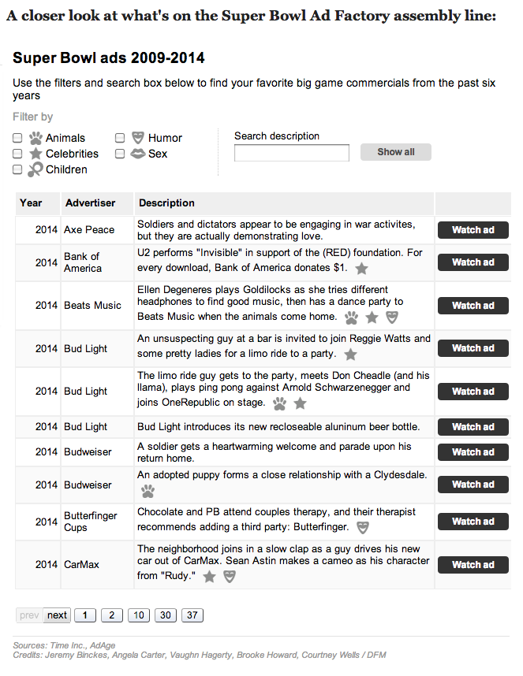

# Superbowl Ads

## How to use this
You'll need a tab-separated spreadsheet ***with fields in the following order***
```Timestamp	Year	Company	Ad description	Ad title	Categories	YouTube URL	Category: Animals	Category: Celebrity	Category: Children	Category: Humor	Category: Sex```

Save it in the data directory as `data_YEAR.txt` where YEAR is the current year.

Update `data/make_data.php` to reference the data file you created.

Go into the data directory and run make_data.php. That will probably look something like:
```
cd data
php make_data.php
```

Take the output and add it to line 16 of `lib/js/superbowl-ads.js` (in that array). You'll know you put it in the right place when you open up index.html (running on your local webserver) and the page doesn't break.

## What is this?

A searchable list of Super Bowl ads from 2009-2014.
Live demo (scroll a little ways down): 
http://www.denverpost.com/ci_25020593/take-look-inside-super-bowl-ad-factory



## Credits

Vaughn Hagerty, Joe Murphy

## Assumptions

* jQuery
* Google visualization API
* handlebars.js


## License

This code is available under the MIT license. For more information, please see the LICENSE file in this repo.
